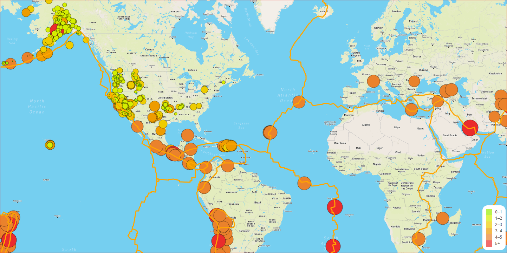
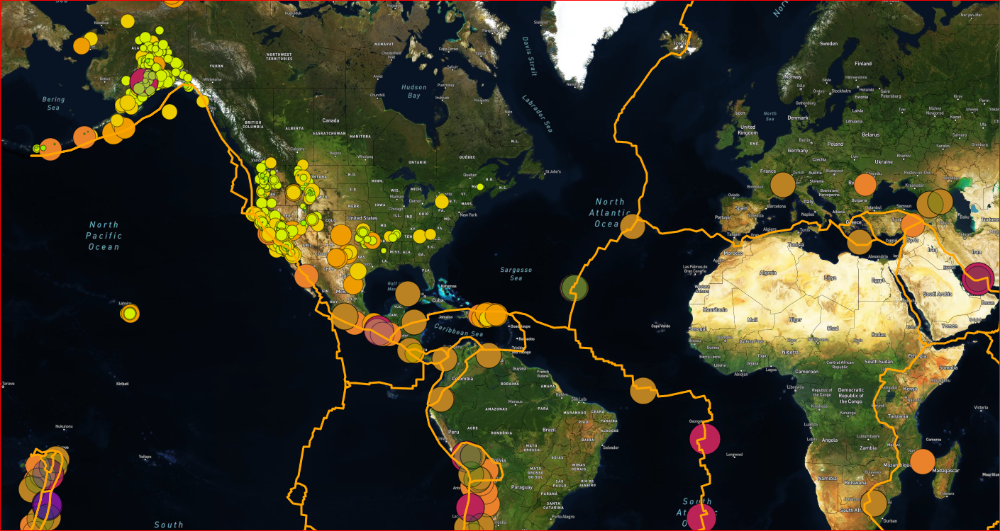
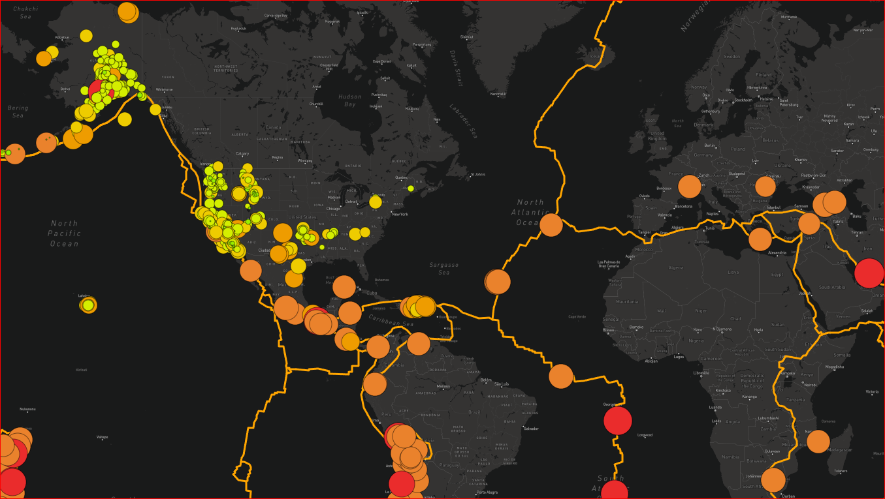

# Mapping_Earthquakes
## Overview of the project:
Map the earthquake data in relation to the tectonic plates’ location on the earth, show all the earthquakes with a magnitude greater than 4.5 on the map.

* Created two base map using leaflet.us with the street map of the world with earthquake data & tectonic plate data

* Added major earthquake data ( magnitude greater than 4.5)Used different color to distinguish from the first earthquake data.

* Added third base layer to the map.

